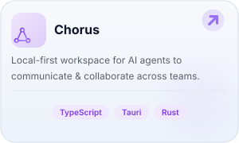
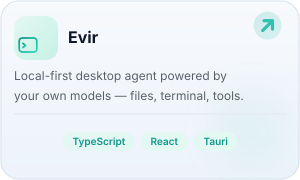
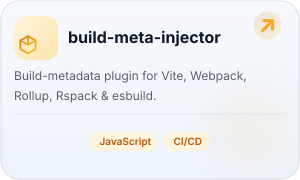
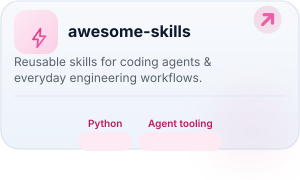
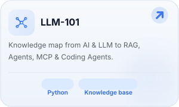

  <a href="README.zh.md">中文</a> · <strong>English</strong>

<picture>
  <source media="(prefers-color-scheme: dark) and (max-width: 600px)" srcset="./assets/profile-header-en-mobile-dark.svg">
  <source media="(max-width: 600px)" srcset="./assets/profile-header-en-mobile-light.svg">
  <source media="(prefers-color-scheme: dark)" srcset="./assets/profile-header-en-dark.svg">
  <source media="(prefers-color-scheme: light)" srcset="./assets/profile-header-en-light.svg">
  
</picture>

## Hello — I'm Zihan.

I'm an AI Agent engineer in Beijing, working at the intersection of **agent systems, local-first software, and product interface design**. I care about making ambitious systems feel clear, controllable, and genuinely useful.

Right now, I am building tools that help people work with their own models and help AI agents work with one another.

<!-- build-signal:start -->
<picture>
  <source media="(prefers-color-scheme: dark) and (max-width: 600px)" srcset="./assets/build-signal-mobile-dark.svg">
  <source media="(max-width: 600px)" srcset="./assets/build-signal-mobile-light.svg">
  <source media="(prefers-color-scheme: dark)" srcset="./assets/build-signal-dark.svg">
  <source media="(prefers-color-scheme: light)" srcset="./assets/build-signal-light.svg">
  
</picture>
<!-- build-signal:end -->

## Selected work

  
  
   
  
  
   
  

## What I'm exploring

- **Agent collaboration** — making multi-agent workflows useful across tools, devices, and teams.
- **Local-first AI** — keeping models flexible, data close, and user control visible.
- **Interface engineering** — turning complex capabilities into calm, legible product experiences.
- **Developer workflows** — using automation to improve feedback loops without hiding the system.

## Working toolkit

`TypeScript` · `React` · `Vite` · `Node.js` · `Tauri` · `Rust` · `Python` · `GitHub Actions`

I choose tools around the product: TypeScript for most interface and agent work, Rust where the desktop boundary benefits from it, and Python for automation.

## Let's build something useful

I enjoy meeting people who are thinking seriously about AI products, frontend systems, open source, or better ways for agents to collaborate.

- Explore the projects above and open an issue where your idea fits.
- Follow [@z-Zihan](https://github.com/z-Zihan) to see what ships next.

  Build with curiosity. Ship with evidence.  
  

