<!--
  Hi there! Thanks for visiting my profile!
  🌙 Welcome to my digital corner
-->

<!-- Default: English | 默认: 英文 -->
<!-- 🌐 Multi-language: see language switcher below -->

# 👋 Hi, I'm Zihan (张子涵)!

 🌟 *"Through every storm, still I chase the sky."*

<!-- vibe-coding:start -->

  <picture>
    <source media="(prefers-color-scheme: dark)" srcset="./assets/vibe-coding-dark.svg">
    <source media="(prefers-color-scheme: light)" srcset="./assets/vibe-coding-light.svg">
    
  </picture>

<!-- vibe-coding:end -->

---

## 🎯 About Me

### 👨‍💻 Identity
- **Frontend Engineer** 📱
- **AI Tech Enthusiast** 🤖
- **Open Source Contributor** 🌟

### 📍 Basic Info
- 🏠 Location: Beijing, China
- 💼 Occupation: Frontend Development
- 🎯 Goal: Full-stack Engineer

### ❤️ Passions
- 🤝 Making friends — always open to chat
- 🚀 Exploring cutting-edge AI
- 💫 Vibe Coding enthusiast
- 📚 Lifelong learner

---

## 💡 My Credo

*"Code is not just a tool — it's a bridge between people and possibilities."*

I believe in:
- 🌐 **Tech Without Borders** — Open source connects developers worldwide
- 🤖 **AI Empowers the Future** — Frontier AI reshapes how we build
- ✨ **Vibe Coding** — Creating beautiful code in flow state
- 🤝 **Sharing is Growth** — Tech exchanges make us all stronger

---

## 🛠️ Tech Stack

### Core Skills

  

### Frontend Frameworks

  

### AI & LLM Tools

  
  
  
  
  

### Development Tools

  

### Frontend & Beyond

  
  
  

---

## 🔥 Currently Focused On

### 🤖 AI Frontier
- LLM Application Development
- AI-Assisted Programming
- Intelligent UI Generation

### 💫 Vibe Coding
- Flow-state Programming
- AI Pair Programming
- High-efficiency Dev Workflows

### 🚀 Frontend Tech
- Web Components
- Performance Optimization

---

## 📚 Learning

- [ ] **LLM & Large Model Apps** — How AI transforms frontend dev
- [ ] **Vibe Coding Workflows** — Crafting the ultimate coding flow
- [ ] **AI Coding Tools** — Claude Code, Codex & Hermes deep dive
- [ ] **Web Components** — Building reusable component libraries
- [ ] **Rust + WASM** — New possibilities for high-perf frontend

---

## 🌟 Featured Project

  
   
  
  &nbsp;
  
   
  📚 A collection of OpenClaw skills — CI/CD auto-publish to ClawHub

---

## 🤝 Let's Connect

I love making friends — feel free to reach out from anywhere in the world!

**Let's talk about:**

| Area | Topics |
|------|--------|
| 💻 Tech | Frontend, AI Apps, Vibe Coding |
| 🎨 Design | UI/UX, User Experience, Interaction |
| 🚀 Career | Growth, Dev, Industry Trends |
| 🎮 Life | Games, Music, Travel, Food |

**Looking for:**
- 👥 Like-minded tech partners
- 🤝 Open source collaboration
- 💡 Interesting project ideas
- 🌍 Friends from diverse backgrounds

---

<!-- 📝 Blog section temporarily disabled
## 📝 Blog

[🚧 Visit my blog and leave a footprint!](https://zzihanaini.vercel.app/)
-->

---

**Thanks for visiting!** 🎉

**Let's connect and build the future with code & AI!** 🚀

Made with 💜 & 🤖 by Zihan

