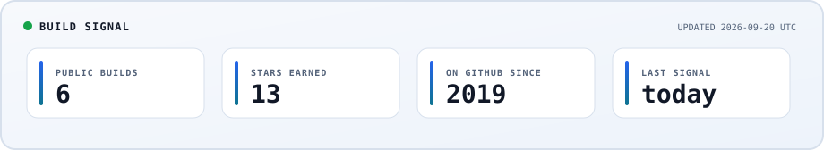

  <strong>中文</strong> · <a href="README.md">English</a>

<picture>
  <source media="(prefers-color-scheme: dark) and (max-width: 600px)" srcset="./assets/profile-header-zh-mobile-dark.svg">
  <source media="(max-width: 600px)" srcset="./assets/profile-header-zh-mobile-light.svg">
  <source media="(prefers-color-scheme: dark)" srcset="./assets/profile-header-zh-dark.svg">
  <source media="(prefers-color-scheme: light)" srcset="./assets/profile-header-zh-light.svg">
  
</picture>

## 你好，我是子涵。

我是一名在北京的 AI Agent 工程师，专注于 **Agent 系统、本地优先软件与产品界面设计** 的交叉领域。我希望把有野心的复杂系统，做得清晰、可控，并且真正有用。

最近，我在构建让人们自由使用自己的模型、也让不同 AI Agent 能够彼此协作的工具。

<!-- build-signal:start -->
<picture>
  <source media="(prefers-color-scheme: dark) and (max-width: 600px)" srcset="./assets/build-signal-mobile-dark.svg">
  <source media="(max-width: 600px)" srcset="./assets/build-signal-mobile-light.svg">
  <source media="(prefers-color-scheme: dark)" srcset="./assets/build-signal-dark.svg">
  <source media="(prefers-color-scheme: light)" srcset="./assets/build-signal-light.svg">
  
</picture>
<!-- build-signal:end -->

## 代表作品

| 项目 | 它解决什么问题 | 技术栈 |
| :-- | :-- | :-- |
| **[Chorus](https://github.com/z-Zihan/Chorus)** | 让 AI Agent 跨 CLI、设备与团队沟通协作的本地优先工作台。 | TypeScript · Tauri · Rust |
| **[Evir](https://github.com/z-Zihan/Evir)** | 由用户自己的模型驱动、可操作文件与终端、强调明确控制权的本地优先桌面 Agent。 | TypeScript · React · Tauri |
| **[build-meta-injector](https://github.com/z-Zihan/build-meta-injector)** | 为 Vite、Webpack、Rollup、Rspack 与 esbuild 统一注入构建元数据。 | JavaScript · CI/CD |
| **[awesome-skills](https://github.com/z-Zihan/awesome-skills)** | 面向编程 Agent 和日常工程工作流的实用、可复用 Skills 合集。 | Python · Agent 工具链 |

## 我正在探索

- **Agent 协作** — 让多 Agent 工作流真正跨工具、设备与团队运转。
- **本地优先 AI** — 保持模型选择自由、数据留在本地、控制权清晰可见。
- **界面工程** — 把复杂能力转化为平静、清楚、易理解的产品体验。
- **开发者工作流** — 用自动化缩短反馈链路，同时不把系统藏进黑盒。

## 常用工具

`TypeScript` · `React` · `Vite` · `Node.js` · `Tauri` · `Rust` · `Python` · `GitHub Actions`

我会围绕产品选择技术：多数界面和 Agent 工作使用 TypeScript；桌面系统边界需要可靠性时使用 Rust；自动化任务则常用 Python。

## 一起做点真正有用的事

我很愿意认识同样认真思考 AI 产品、前端系统、开源，以及 Agent 协作方式的朋友。

- 你可以从上面的项目开始，在合适的仓库里提出想法或 Issue。
- 关注 [@z-Zihan](https://github.com/z-Zihan)，看看接下来会发布什么。

  带着好奇构建，用真实证据交付。  
  

